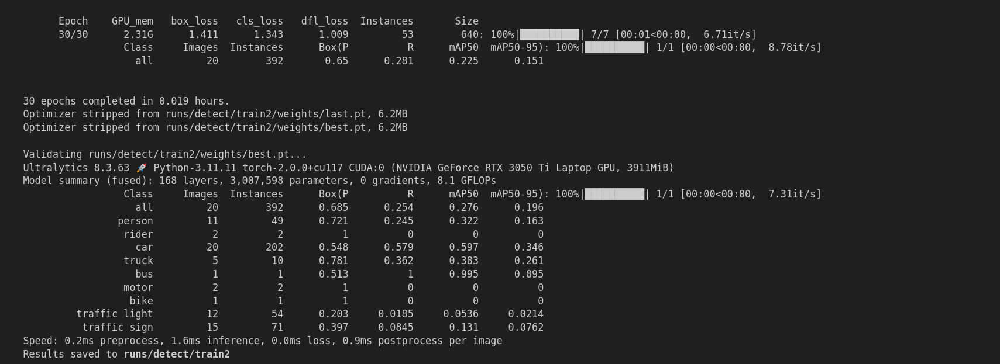

Model Training Process
======================

Directory Structure
-------------------

The model training process is organized as follows:

```
.
├── bdd_to_yolo.py     # Script to convert bdd100k to yolo format
├── dataset            # Dataset Folder (Sample data)
│   ├── classes.txt
│   ├── images
│   └── labels
├── dataset.yml        # Configuration file for training
├── runs               # Output folder from model training
│   └── detect
├── training.ipynb     # Training Notebook
├── training_steps.png # Trainig completed image
└── yolov8n.pt         # Pretrained model for training
```

### Step-by-Step Process

#### Step 1: Data Conversion

Using `bdd_to_yolo.py`, convert the BDD100K format dataset to YOLO format.

**Paths Configuration in bdd_to_yolo.py:**

-   **Input JSON Files:**

    -   `train_path`: `../../assignment_data_bdd/bdd100k_labels_release/bdd100k/labels/bdd100k_labels_images_train.json` (BDD train JSON file)

    -   `val_path`: `../../assignment_data_bdd/bdd100k_labels_release/bdd100k/labels/bdd100k_labels_images_val.json` (BDD validation JSON file)

-   **Input Image Folders:**

    -   `train_images_folder`: `dataset/images/train` (Train images directory)

    -   `val_images_folder`: `dataset/images/val` (Validation images directory)

-   **Output YOLO Label Directories:**

    -   `train_output_dir`: `dataset/labels/train` (Output directory for train labels)

    -   `val_output_dir`: `dataset/labels/val` (Output directory for validation labels)

Run the script to generate the YOLO format labels. This creates text files corresponding to each image.

* * * * *

#### Step 2: Verify Annotations

After conversion, use a labeling tool (e.g., LabelImg or Roboflow) to verify the correctness of the annotations.

* * * * *

#### Step 3: Dataset Preparation

Organize the dataset folder structure as follows:

```
dataset
├── classes.txt  # List of class names
├── images
│   ├── train  # Train images (e.g., 100 images for sample training)
│   └── val    # Validation images (e.g., 20 images for sample training)
└── labels
    ├── train  # YOLO format labels for train images
    └── val    # YOLO format labels for validation images
```

Create or update the `dataset.yml` configuration file:

```
path: dataset # dataset root dir
train: images/train # train images (relative to 'path')
val: images/val # val images (optional)
test: # test images (optional)

# Classes
names:
 0: person
 1: rider
 2: car
 3: truck
 4: bus
 5: train
 6: motor
 7: bike
 8: traffic light
 9: traffic sign
```

* * * * *

#### Step 4: Modify `dataset.yml`

Ensure the file paths and class names in `dataset.yml` match your dataset structure.

* * * * *

#### Step 5: Start Training

Open `training.ipynb` and follow the notebook steps to initiate training.

**Key Points in the Notebook:**

-   Load the YOLOv8 model weights (`yolov8n.pt`).

-   Configure training parameters such as:

    -   Batch size

    -   Epochs

    -   Learning rate

-   Start the training process.

The training process will begin, and the results will be logged in the `runs` directory.

* * * * *

#### Step 6: Monitor Results

The results, including metrics and visualizations, will be stored in the `runs` folder. You can analyze the training performance and iterate as needed.

* * * * *

### Notes

-   For sample training, only 100 images for training and 20 for validation are used to expedite the process.

-   Ensure dependencies and environments are set up correctly before running scripts or the notebook.




* * * * *
* * * * * 
### Why Choosing YOLO?

#### 1\. Real-Time Performance

-   **Why it matters:** The BDD100K dataset contains high-resolution images with diverse traffic scenes, and real-time inference is often critical for applications such as autonomous driving and traffic monitoring.

-   **How YOLO helps:** YOLO (You Only Look Once) models are known for their ability to achieve real-time object detection with high FPS (frames per second), making them ideal for latency-sensitive applications.

#### 2\. Single-Stage Detection

-   **Why it matters:** Single-stage detectors like YOLO directly predict bounding boxes and class probabilities, offering a streamlined pipeline compared to two-stage detectors like Faster R-CNN, which can be computationally intensive.

-   **How YOLO helps:** YOLO's end-to-end approach reduces training and inference time without compromising accuracy, making it efficient for large datasets such as BDD100K.

#### 3\. Scalability Across Model Sizes

-   **Why it matters:** The BDD100K dataset is extensive, and leveraging scalable models can help balance accuracy and computational requirements depending on the available hardware.

-   **How YOLO helps:** The YOLO family (e.g., YOLOv8) offers a range of model sizes (e.g., YOLOv8n, YOLOv8s, YOLOv8m) that cater to different hardware capabilities, from resource-constrained environments to high-performance setups.

#### 4\. Excellent Generalization on Diverse Datasets

-   **Why it matters:** The BDD100K dataset includes a wide variety of scenes, lighting conditions, and weather scenarios, which require models that generalize well.

-   **How YOLO helps:** YOLO models are designed to perform well on diverse datasets, with robust performance across different environments and object classes.

#### 5\. Community Support and Pretrained Models

-   **Why it matters:** Leveraging pretrained weights can significantly speed up training and improve results, especially on datasets like BDD100K with a large number of images and annotations.

-   **How YOLO helps:** The YOLO ecosystem offers pretrained models on large-scale datasets like COCO, which can be fine-tuned for BDD100K to achieve high accuracy with reduced training time.

#### 6\. Accuracy-Performance Tradeoff

-   **Why it matters:** Autonomous driving and other real-world applications require a balance between precision and speed to make timely and accurate decisions.

-   **How YOLO helps:** YOLO models have been shown to achieve competitive accuracy while maintaining high-speed inference, making them suitable for real-world deployment.

#### 7\. Proven Track Record

-   **Why it matters:** YOLO has been extensively used in academic and industry applications for object detection, demonstrating its reliability and adaptability to various datasets.

-   **How YOLO helps:** The extensive research and real-world success stories of YOLO models reinforce its suitability for challenging datasets like BDD100K.
